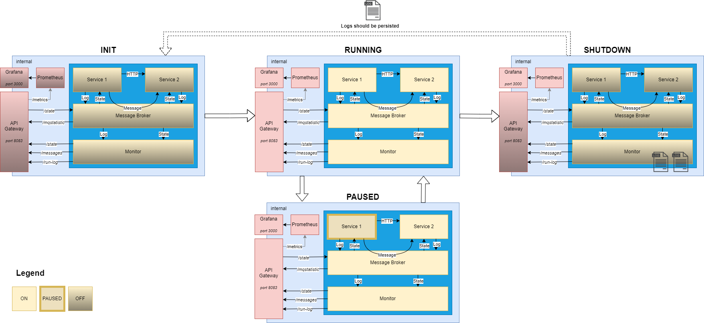
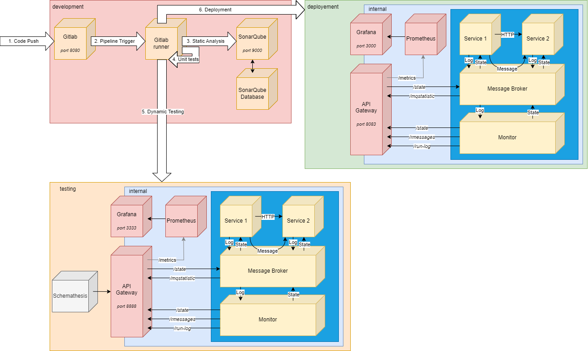

# Project Overview

The goal here is to create a relatively simple but complete micro-service based system with a complete CI/CD pipeline.
In this project, we used Gitlab with Gitlab CI/CD for the pipeline (please see [gitlab configuration](#gitlab-configuration)).

Langages used are [Rust](https://www.rust-lang.org/) (service 1), [Kotlin](https://kotlinlang.org/) (service 2 and gateway) and [Java](https://www.java.com) (monitor).

The final report is available [here](./EndReport.pdf).

## System

Here is an overview of the system:


The service 1 produce dated messages and send them to service 2 via both HTTP and a RabbitMQ queue.
The monitor keeps track of the logs of both services and the changes of state.

Here is a summary of the routes available via the gateway:
```
├── message
│   └── GET (get logs)
├── state
│   ├── PUT (toggle state) (payload “PAUSED”, “RUNNING”, “SHUTDOWN”)
│   └── GET (current value of state)
├── run-log
│   └── GET (get information about state changes)
└── mqstatistic
└── GET (statistics from RabbitMQ)
```

The state of the system can be toggled by sending PUT requests with a body of either “PAUSED”, “RUNNING” or “SHUTDOWN” to the `/state` gateway endpoint:



## GitLab configuration

For this project, I used a local dockerized installation of GitLab. It can be replicated 
by following [this tutorial](./gitlab/gitlab_setup.md).

The tutorial also contains an optional part about setting up SonarQube and linking it to GitLab.

## CI/CD Pipeline

Here is an overview of the whole pipeline, each box is a container:



Here [Schemathesis](https://schemathesis.io/) is used to test the Gateway API using a pre-defined [OpenAPI](https://swagger.io/specification/) specification file (you can find it [here](./tests/apis/openapi.yml)).

## Pipeline Logs

You can see an example of log from each pipeline step in the following files:
- [static-analysis log file (passing)](./documentation/logs/static-analysis-success.log)
- [static-analysis log file (failing)](./documentation/logs/static-analysis-failed.log)
- [build log file](./documentation/logs/build.log)
- [unit-tests log file (passing)](./documentation/logs/unit-tests-success.log)
- [unit-tests log file (passing)](./documentation/logs/unit-tests-failed.log)
- [system-tests log file (passing)](./documentation/logs/system-tests-success.log)
- [system-tests log file (failing)](./documentation/logs/system-tests-failed.log)
- [deploy log file](./documentation/logs/deploy.log)

# Comments

In a more complete solution, a more complete build step would be implemented to publish the images to a registry and use versioning.

To simplify deployment, I used docker compose rather than a more extensive solution like Kubernetes.