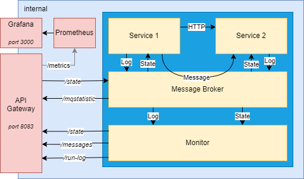

# Project Overview

Langages used are [Rust](https://www.rust-lang.org/) (service 1), [Kotlin](https://kotlinlang.org/) (service 2 and gateway) and [Java](https://www.java.com) (monitor).

## GitLab configuration

For this project, I used a local dockerized installation of GitLab. It can be replicated 
by following [this tutorial](./gitlab/gitlab_setup.md).

The tutorial also contains an optional part about setting up SonarQube and linking it to GitLab.

## Architecture

## Pipeline Logs

You can see an example of log from each pipeline step in the following files:
- [static-analysis log file (passing)](./documentation/logs/static-analysis-success.log)
- [static-analysis log file (failing)](./documentation/logs/static-analysis-failed.log)
- [build log file](./documentation/logs/build.log)
- [unit-tests log file (passing)](./documentation/logs/unit-tests-success.log)
- [unit-tests log file (passing)](./documentation/logs/unit-tests-failed.log)
- [system-tests log file (passing)](./documentation/logs/system-tests-success.log)
- [system-tests log file (failing)](./documentation/logs/system-tests-failed.log)
- [deploy log file](./documentation/logs/deploy.log)